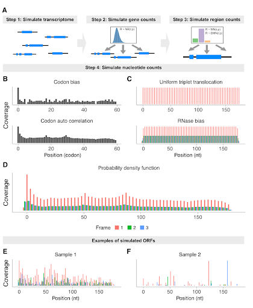

# coverageSim
### Simulating Ribosome profiling data for tool validation



## How to install
```r
if (!requireNamespace("devtools", quietly = TRUE)) install.packages("devtools")
devtools::install_github("Roleren/coverageSim")
```

## Simple example

Lets make a genome with 6 genes, each being coding (they have a CDS) and
having 1 translated uORF:

```r
library(coverageSim)
library(ORFik)
## Simple example
# 6 genes on 6 chromosomes (1 active uORF each)
simGenome6 <- simGenome(n = 6, max_uorfs = 1)
# Simulate Ribo-seq only
gene_count_table <-simCountTables(loadRegion(simGenome6["txdb"], "cds"),
libtypes = "RFP", print_statistics = FALSE)
region_count_table <- simCountTablesRegions(gene_count_table,
     regionsToSample = c("leader", "cds", "trailer"))
df <- simNGScoverage(simGenome6, region_count_table)
```

The ORFik experiment object (df), now contains all linkers to resulting files.

## Convert to other track formats

```r
# Convert to bigwig
ORFik::convert_to_bigWig(df)

```
ORFik supports multiple other formats to convert to, also coverageSim internally has
a option to simulate bam files from the ofst track output files.

## Relevant paths for other programs

```r
# Transcript annotation (.gtf)
gtf_path <- ORFik:::getGtfPathFromTxdb(loadTxdb(df))
# Genome sequences (.fasta)
fasta_genome_path <- df@fafile
# NGS track files (.bigwig, pairwise for forward and reverse strands)
bigwig_paths <- filepath(df, "bigwig")
```

## Export to IGV

- Open IGV,
- Press "Genomes" tab (top left), "Create .genome file"
- Unique Identifier: "Sim genome", Descriptive name: "Sim genome", 
- FASTA file: input fasta_genome_path above
- Gene file: input gtf_path above
- Press OK

Now load bigwig files by: 

- Press "File" (top left), "Load from File"
- load all paths from bigwig_paths above

You now have genome, gtf and tracks loaded in IGV
